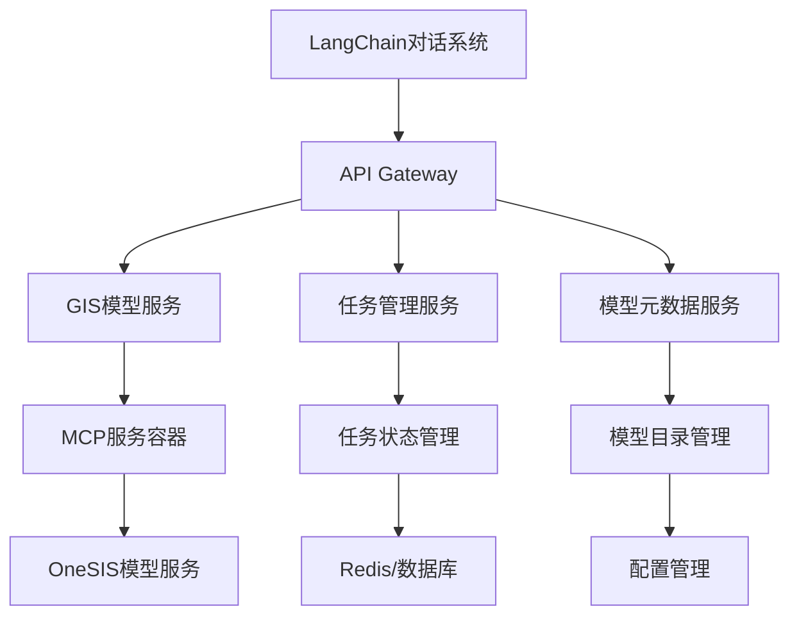

# 当前可调用的模型列表
_Exported on 2025/7/15 at GMT+8 11:49:51 from Cursor (1.2.4)_

---

**User**

列一下现在有哪些GIS模型可以调用

---

**Cursor**

我来查看一下当前系统中可用的GIS模型。

---

**User**

继续

---

**Cursor**

当前可调用的GIS模型如下（部分模型及其简介）：

| 模型名称 | 简要描述 |
|---|---|
| euclidean_distance_analysis | 基于欧氏距离对矢量数据进行分析 |
| random_forest_probability | 随机森林分类概率输出 |
| speculation_area_confirm | 作物地块面积统计 |
| add_crop_confid | 给地块矢量添加物候置信度 |
| add_phenology | 区域赋值物候信息 |
| d8distdowntostream_taudem_ext | 计算栅格到最近河流的距离 |
| csu_workflow_mode3_multiple_liner_predication | 空气质量多元线性回归预测 |
| csu_workflow_mode2_clusters | 空气站点时空聚类与分区（GeoSOM） |
| csu_workflow_mode1_argument_select | 空气质量相关气象特征选择 |
| land_development_potential | 土地开发潜力分析 |
| distance_analysis_water | 基于欧氏距离对水体矢量分析 |
| distance_analysis_road | 基于欧氏距离对道路矢量分析 |
| MGWR_TXT_R | 多尺度地理加权回归 |
| GWR_TXT_R | 地理加权回归 |
| NSGA_II | 多目标遗传算法优化 |
| las_vegas | 拉斯维加斯随机算法分析 |
| spacetimeprism | 路网时空棱柱建模 |
| k_shortest_path_lpa | 路网最短路径规划（aStar算法） |
| buffer_network | 道路网缓冲区分析 |
| twostepsfloating | 两步移动法可达性分析 |
| gravityaccess | 重力衰减可达性分析 |
| cumaccess | 累计可达性分析 |
| project | 坐标系定义与投影 |
| montecarlo | 序贯高斯模拟 |
| visibility_whiteboxtools | 地形可见性度量 |
| viewshed_whiteboxtools | 地形可视域分析 |
| twi | 土壤湿度指数 |
| slope_taylor-series_whiteboxtools | 坡度计算 |
| slope_max-downslope | 最大下坡方向坡度 |
| roughness_gdal | 地表起伏度量 |
| tangentialcurvature_whiteboxtools | 切向曲率计算 |
| ProfileCurvature_whiteboxtools | 剖面曲率计算 |
| plan_curvature | 水平面曲率 |
| convergence_index_sagagis | 地形汇聚指数 |
| aspect_taylor-series_whiteboxtools | 坡向计算 |
| StreamPowerIndex_whiteboxtools | 水流功率指数 |
| rasterstreamgrid_extraction_taudem | 河网提取 |
| pitRemove | 填洼算法 |
| FillDepressions_whiteboxtools | 填洼算法 |

如需详细参数或调用方式，可指定具体模型名称，我会进一步补充。  
如需全部模型的完整表格或导出，也可告知。

---

**User**

我想看下河网提取算法的信息

---

**Cursor**

河网提取（栅格）算法信息如下：

---

### 基本信息

- **模型名称**：河网提取（栅格）
- **英文名**：stream raster grid extraction
- **简介**：将汇流累积量按照确定的阈值进行栅格河网的提取
- **应用领域**：水文分析数据预处理
- **适用数据类型**：栅格数据
- **主要关键词**：地形分析、水文分析、单流向

---

### 算法原理

- 基于汇流累积量（flow accumulation），通过设定阈值，确定哪些栅格属于河网。
- 参考文献：  
  O'Callaghan, J. F., Mark, D. M. 1984. The extraction of drainage networks from digital elevation data. Computer Vision, Graphics, and Image Processing, 28(3): 323–344

---

### 主要参数

| 参数名 | 说明 | 类型 | 是否必需 | 默认值 |
|---|---|---|---|---|
| np | 进程数（MPI计算核数） | int | 是 | 1 |
| 河网提取算法 | 算法名称（一般为threshold） | str | 是 | threshold |
| ssa | d8汇流累积量栅格 | tif | 是 | - |
| src | 提取的河网栅格 | tif | 是 | - |
| thresh | 河网提取阈值 | str | 是 | 100.0 |

---

### 使用示例

```shell
docker run -v $(pwd)/data:/data crazyzlj/taudem_ext:alpine-openmpi-gdal-latest [-np <nproc>] threshold -ssa /data/demad8.tif -src /data/demsrc.tif -thresh 100.0
```

---

### 输出

- 输出河网栅格（tif），可直接显示。

---

### 其他信息

- **开发维护**：Zi-Yue Chen, Institute of Geographic Sciences and Natural Resources Research
- **开源仓库**：[TauDEM_ext GitHub](https://github.com/lreis2415/TauDEM_ext)
- **集成软件**：taudem_ext（TauDEM5.3，GPLv3）

---

如需参数详细说明或调用代码示例，请告知！

```plaintext
docker run -v $(pwd)/data:/data crazyzlj/taudem_ext:alpine-openmpi-gdal-latest [-np <nproc>] threshold -ssa /data/demad8.tif -src /data/demsrc.tif -thresh 100.0
```

---

**User**

我想调看一下流向算法的信息

---

**Cursor**

流向算法（最大下坡法）相关信息如下：

---

### 基本信息

- **模型名称**：坡度（最大下坡）
- **英文名**：Slope (max-downslope)
- **简介**：计算栅格8邻域中最大下坡方向的地表坡面空间倾斜程度
- **应用领域**：地形因子提取、水文分析
- **适用数据类型**：DEM数据
- **主要关键词**：地形分析、水文分析、单流向

---

### 算法原理

- 以最大下坡法为例：在8邻域窗口中，计算中心格网与周围格网的高程差与格网间距比值，取最大值作为坡度，坡度方向即为最大下坡方向（即D8流向算法的核心思想）。
- 参考文献：  
  Jones, K. H. 1998. A comparison of algorithms used to compute hill slope as a property of the DEM. Computers & Geosciences, 24(4): 315–323.

---

### 主要参数

| 参数名 | 说明 | 类型 | 是否必需 | 默认值 |
|---|---|---|---|---|
| np | 进程数（MPI计算核数） | int | 是 | 1 |
| 坡度算法 | 算法名称（如d8flowdir） | str | 是 | d8flowdir |
| fel | 已填洼数字高程模型（filled DEM） | tif | 是 | - |
| sd8 | 坡度栅格输出 | tif | 是 | - |

---

### 使用示例

```shell
docker run -v $(pwd)/data:/data crazyzlj/taudem_ext:alpine-openmpi-gdal-latest [-np <nproc>] slope -fel /data/demfel.tif -p /data/demp.tif -sd8 /data/demsd8.tif
```

---

### 输出

- 输出坡度栅格（tif），可直接显示。

---

### 其他信息

- **开发维护**：Zi-Yue Chen, Institute of Geographic Sciences and Natural Resources Research
- **开源仓库**：[TauDEM_ext GitHub](https://github.com/lreis2415/TauDEM_ext)
- **集成软件**：taudem_ext（TauDEM5.3，GPLv3）

---

如需D8流向栅格的详细输出说明或调用代码示例，请告知！

```plaintext
docker run -v $(pwd)/data:/data crazyzlj/taudem_ext:alpine-openmpi-gdal-latest [-np <nproc>] slope -fel /data/demfel.tif -p /data/demp.tif -sd8 /data/demsd8.tif
```

---

**User**

我想调用一下填哇算法

---

**Cursor**

你可以通过调用 pitRemove 或 FillDepressions_whiteboxtools 两个模型来实现“填洼”操作。下面以 pitRemove 为例，给出调用说明和参数表：

---

### 填洼算法（pitRemove）模型信息

- **模型名称**：pitRemove
- **功能简介**：调整洼地区域高程值，使模拟过程中洼地内水流能顺畅向低处流动。
- **常用场景**：DEM预处理，水文分析前的高程修正。

---

#### 主要参数

| 参数名   | 说明           | 类型 | 是否必需 | 备注         |
|----------|----------------|------|----------|--------------|
| dem      | 输入DEM栅格    | tif  | 是       | 原始高程数据 |
| dem_filled | 输出填洼后DEM | tif  | 是       | 结果路径     |
| algorithm | 算法名称      | str  | 否       | 如 horn      |

---

#### Python调用示例

```python
from pygeomodels.config import parse_config
from pygeomodels.modelBank import modelBank

cfg = parse_config()
model_bank = modelBank(cfg)
caller = model_bank.models_caller

inputs = {"dem": "/path/to/input_dem.tif"}
params = {"algorithm": "horn"}  # 可选
outputs = {"dem": "/path/to/output_dem_filled.tif"}

project_id = caller.pitRemove(inputs, params, outputs)
print("任务提交成功，project_id:", project_id)
```

---

#### 注意事项

- 路径请替换为你实际的数据路径。
- 输出 project_id 后，可用 modelTask 查询进度、日志等。

---

如需 shell/docker 命令、FillDepressions_whiteboxtools 的参数说明，或完整任务管理流程，请告知！

```python
from pygeomodels.config import parse_config
from pygeomodels.modelBank import modelBank

cfg = parse_config()
model_bank = modelBank(cfg)
caller = model_bank.models_caller

inputs = {"dem": "/path/to/input_dem.tif"}
params = {"algorithm": "horn"}  # 可选
outputs = {"dem": "/path/to/output_dem_filled.tif"}

project_id = caller.pitRemove(inputs, params, outputs)
print("任务提交成功，project_id:", project_id)
```

---

**User**

我的参数如下：  "inputs": {
    "z": "/onesis/kt4/test_data/terr/dem_meixi.tif"
  },
  "params": {},
  "outputs": {
    "fel": "/onesis/kt4/test_data/terr/results/dem_meixifel071202.tif"
  }帮我运行一下

---

**Cursor**

已成功提交“填洼算法”任务，任务ID（project_id）为：

```
43734a8eda4d4e8b8cc64e160e561b2d
```

你可以使用此 project_id 查询任务进度、日志或结果。如需进一步操作（如进度查询、日志查看、结果获取等），请告知！

```plaintext
43734a8eda4d4e8b8cc64e160e561b2d
```

---

**User**

我有一个使用langchain构建的智能对话仓库，请问怎么高效地给它接入当前的MCP？

---

**Cursor**

我来帮你分析如何高效地将当前的MCP服务接入到LangChain智能对话系统中。


基于你的MCP服务和LangChain智能对话系统，我为你提供几种高效的集成方案：

## 方案一：直接HTTP调用集成（推荐）

### 1. 创建LangChain工具类

```python
from langchain.tools import BaseTool
from typing import Dict, Any, Optional
import requests
import json

class PyGeoModelsTool(BaseTool):
    name = "pygeomodels_gis_analysis"
    description = "用于执行地理空间分析任务，包括地形分析、水文分析等GIS模型调用"
    
    def __init__(self, mcp_server_url: str = "http://localhost:8000"):
        super().__init__()
        self.mcp_server_url = mcp_server_url
    
    def _run(self, query: str) -> str:
        """执行GIS分析任务"""
        try:
            # 解析用户查询，构建请求体
            request_body = self._parse_query_to_request(query)
            
            # 调用MCP服务
            response = requests.post(
                f"{self.mcp_server_url}/run_model",
                json=request_body,
                headers={"Content-Type": "application/json"}
            )
            
            if response.status_code == 200:
                result = response.json()
                project_id = result.get("result")
                return f"任务提交成功！项目ID: {project_id}"
            else:
                return f"任务提交失败: {response.text}"
                
        except Exception as e:
            return f"执行出错: {str(e)}"
    
    def _parse_query_to_request(self, query: str) -> Dict[str, Any]:
        """将自然语言查询解析为MCP请求体"""
        # 这里可以使用简单的规则匹配或更复杂的NLP处理
        if "填洼" in query or "pit" in query.lower():
            return {
                "model_name": "pitRemove",
                "inputs": {"z": "/path/to/dem.tif"},
                "params": {},
                "outputs": {"fel": "/path/to/output.tif"},
                "task_name": "填洼任务"
            }
        # 添加更多模型匹配规则...
        
        return {"error": "未识别的模型类型"}
```

### 2. 集成到LangChain Agent

```python
from langchain.agents import initialize_agent, AgentType
from langchain.llms import OpenAI

# 初始化工具
gis_tool = PyGeoModelsTool()

# 创建Agent
llm = OpenAI(temperature=0)
agent = initialize_agent(
    tools=[gis_tool],
    llm=llm,
    agent=AgentType.ZERO_SHOT_REACT_DESCRIPTION,
    verbose=True
)

# 使用示例
response = agent.run("帮我执行DEM填洼分析，输入文件是/onesis/kt4/test_data/terr/dem_meixi.tif")
```

## 方案二：MCP客户端集成

### 1. 创建MCP客户端工具

```python
from langchain.tools import BaseTool
from mcp import ClientSession, StdioServerParameters
import asyncio

class MCPGeoModelsTool(BaseTool):
    name = "mcp_geomodels"
    description = "通过MCP协议调用地理空间分析模型"
    
    def __init__(self, mcp_server_path: str = "python pygeomodels_service.py"):
        super().__init__()
        self.mcp_server_path = mcp_server_path
    
    async def _arun(self, query: str) -> str:
        """异步执行MCP调用"""
        server_params = StdioServerParameters(
            command=self.mcp_server_path
        )
        
        async with ClientSession(server_params) as session:
            # 获取可用模型列表
            models = await session.list_models()
            
            # 根据查询选择合适的模型
            model_name = self._select_model(query, models)
            
            if model_name:
                # 执行模型
                result = await session.call_tool(
                    "run_model",
                    {
                        "model_name": model_name,
                        "inputs": self._extract_inputs(query),
                        "params": {},
                        "outputs": self._extract_outputs(query)
                    }
                )
                return f"模型执行结果: {result}"
            else:
                return "未找到合适的模型"
    
    def _select_model(self, query: str, models: list) -> Optional[str]:
        """根据查询选择合适的模型"""
        query_lower = query.lower()
        
        model_mapping = {
            "填洼": "pitRemove",
            "坡度": "slope_taylor-series_whiteboxtools",
            "河网": "rasterstreamgrid_extraction_taudem",
            "可视域": "viewshed_whiteboxtools"
        }
        
        for keyword, model in model_mapping.items():
            if keyword in query_lower:
                return model
        return None
```

## 方案三：RESTful API包装器

### 1. 创建API包装服务

```python
from fastapi import FastAPI, HTTPException
from pydantic import BaseModel
from typing import Dict, Any
import subprocess
import json

app = FastAPI()

class ModelRequest(BaseModel):
    model_name: str
    inputs: Dict[str, str]
    params: Dict[str, Any] = {}
    outputs: Dict[str, str]
    task_name: str = ""

@app.post("/api/geomodels/run")
async def run_model(request: ModelRequest):
    """运行地理模型"""
    try:
        # 调用MCP服务
        result = subprocess.run([
            "python", "pygeomodels_service.py",
            "--run-model",
            json.dumps(request.dict())
        ], capture_output=True, text=True)
        
        if result.returncode == 0:
            return {"success": True, "result": result.stdout}
        else:
            raise HTTPException(status_code=500, detail=result.stderr)
            
    except Exception as e:
        raise HTTPException(status_code=500, detail=str(e))

@app.get("/api/geomodels/models")
async def list_models():
    """获取可用模型列表"""
    # 实现模型列表获取逻辑
    pass
```

### 2. LangChain集成

```python
from langchain.tools import BaseTool
import requests

class RESTGeoModelsTool(BaseTool):
    name = "rest_geomodels"
    description = "通过REST API调用地理空间分析服务"
    
    def __init__(self, api_base_url: str = "http://localhost:8000"):
        super().__init__()
        self.api_base_url = api_base_url
    
    def _run(self, query: str) -> str:
        # 解析查询并调用REST API
        request_data = self._build_request(query)
        
        response = requests.post(
            f"{self.api_base_url}/api/geomodels/run",
            json=request_data
        )
        
        return response.json()
```

## 推荐实施方案

### 阶段一：快速集成（方案一）
1. **优势**：实现简单，快速上线
2. **适用场景**：原型验证，小规模使用

### 阶段二：优化升级（方案二）
1. **优势**：原生MCP支持，性能更好
2. **适用场景**：生产环境，大规模使用

### 阶段三：企业级部署（方案三）
1. **优势**：标准化API，易于扩展
2. **适用场景**：企业级应用，多系统集成

## 关键优化建议

1. **错误处理**：添加完善的异常处理和重试机制
2. **参数验证**：实现智能的参数解析和验证
3. **状态监控**：集成任务状态查询和进度跟踪
4. **缓存机制**：对模型元数据进行缓存，提升响应速度
5. **日志记录**：添加详细的调用日志，便于调试和监控

你希望从哪个方案开始实施？我可以提供更详细的代码实现。

```python
from langchain.tools import BaseTool
from typing import Dict, Any, Optional
import requests
import json

class PyGeoModelsTool(BaseTool):
    name = "pygeomodels_gis_analysis"
    description = "用于执行地理空间分析任务，包括地形分析、水文分析等GIS模型调用"
    
    def __init__(self, mcp_server_url: str = "http://localhost:8000"):
        super().__init__()
        self.mcp_server_url = mcp_server_url
    
    def _run(self, query: str) -> str:
        """执行GIS分析任务"""
        try:
            # 解析用户查询，构建请求体
            request_body = self._parse_query_to_request(query)
            
            # 调用MCP服务
            response = requests.post(
                f"{self.mcp_server_url}/run_model",
                json=request_body,
                headers={"Content-Type": "application/json"}
            )
            
            if response.status_code == 200:
                result = response.json()
                project_id = result.get("result")
                return f"任务提交成功！项目ID: {project_id}"
            else:
                return f"任务提交失败: {response.text}"
                
        except Exception as e:
            return f"执行出错: {str(e)}"
    
    def _parse_query_to_request(self, query: str) -> Dict[str, Any]:
        """将自然语言查询解析为MCP请求体"""
        # 这里可以使用简单的规则匹配或更复杂的NLP处理
        if "填洼" in query or "pit" in query.lower():
            return {
                "model_name": "pitRemove",
                "inputs": {"z": "/path/to/dem.tif"},
                "params": {},
                "outputs": {"fel": "/path/to/output.tif"},
                "task_name": "填洼任务"
            }
        # 添加更多模型匹配规则...
        
        return {"error": "未识别的模型类型"}
```

```python
from langchain.agents import initialize_agent, AgentType
from langchain.llms import OpenAI

# 初始化工具
gis_tool = PyGeoModelsTool()

# 创建Agent
llm = OpenAI(temperature=0)
agent = initialize_agent(
    tools=[gis_tool],
    llm=llm,
    agent=AgentType.ZERO_SHOT_REACT_DESCRIPTION,
    verbose=True
)

# 使用示例
response = agent.run("帮我执行DEM填洼分析，输入文件是/onesis/kt4/test_data/terr/dem_meixi.tif")
```

```python
from langchain.tools import BaseTool
from mcp import ClientSession, StdioServerParameters
import asyncio

class MCPGeoModelsTool(BaseTool):
    name = "mcp_geomodels"
    description = "通过MCP协议调用地理空间分析模型"
    
    def __init__(self, mcp_server_path: str = "python pygeomodels_service.py"):
        super().__init__()
        self.mcp_server_path = mcp_server_path
    
    async def _arun(self, query: str) -> str:
        """异步执行MCP调用"""
        server_params = StdioServerParameters(
            command=self.mcp_server_path
        )
        
        async with ClientSession(server_params) as session:
            # 获取可用模型列表
            models = await session.list_models()
            
            # 根据查询选择合适的模型
            model_name = self._select_model(query, models)
            
            if model_name:
                # 执行模型
                result = await session.call_tool(
                    "run_model",
                    {
                        "model_name": model_name,
                        "inputs": self._extract_inputs(query),
                        "params": {},
                        "outputs": self._extract_outputs(query)
                    }
                )
                return f"模型执行结果: {result}"
            else:
                return "未找到合适的模型"
    
    def _select_model(self, query: str, models: list) -> Optional[str]:
        """根据查询选择合适的模型"""
        query_lower = query.lower()
        
        model_mapping = {
            "填洼": "pitRemove",
            "坡度": "slope_taylor-series_whiteboxtools",
            "河网": "rasterstreamgrid_extraction_taudem",
            "可视域": "viewshed_whiteboxtools"
        }
        
        for keyword, model in model_mapping.items():
            if keyword in query_lower:
                return model
        return None
```

```python
from fastapi import FastAPI, HTTPException
from pydantic import BaseModel
from typing import Dict, Any
import subprocess
import json

app = FastAPI()

class ModelRequest(BaseModel):
    model_name: str
    inputs: Dict[str, str]
    params: Dict[str, Any] = {}
    outputs: Dict[str, str]
    task_name: str = ""

@app.post("/api/geomodels/run")
async def run_model(request: ModelRequest):
    """运行地理模型"""
    try:
        # 调用MCP服务
        result = subprocess.run([
            "python", "pygeomodels_service.py",
            "--run-model",
            json.dumps(request.dict())
        ], capture_output=True, text=True)
        
        if result.returncode == 0:
            return {"success": True, "result": result.stdout}
        else:
            raise HTTPException(status_code=500, detail=result.stderr)
            
    except Exception as e:
        raise HTTPException(status_code=500, detail=str(e))

@app.get("/api/geomodels/models")
async def list_models():
    """获取可用模型列表"""
    # 实现模型列表获取逻辑
    pass
```

```python
from langchain.tools import BaseTool
import requests

class RESTGeoModelsTool(BaseTool):
    name = "rest_geomodels"
    description = "通过REST API调用地理空间分析服务"
    
    def __init__(self, api_base_url: str = "http://localhost:8000"):
        super().__init__()
        self.api_base_url = api_base_url
    
    def _run(self, query: str) -> str:
        # 解析查询并调用REST API
        request_data = self._build_request(query)
        
        response = requests.post(
            f"{self.api_base_url}/api/geomodels/run",
            json=request_data
        )
        
        return response.json()
```

---

**User**

最好能松耦合，方便独立维护。而且未来考虑容器hua

---

**Cursor**

基于你的松耦合和容器化需求，我推荐采用**微服务架构 + 容器化部署**的方案：

## 架构设计



## 方案一：微服务API网关架构（推荐）

### 1. 创建独立的GIS服务API

```python
# services/gis_api/main.py
from fastapi import FastAPI, HTTPException, BackgroundTasks
from pydantic import BaseModel
from typing import Dict, Any, Optional
import httpx
import asyncio
from datetime import datetime
import uuid

app = FastAPI(title="GIS模型服务API", version="1.0.0")

class ModelRequest(BaseModel):
    model_name: str
    inputs: Dict[str, str]
    params: Dict[str, Any] = {}
    outputs: Dict[str, str]
    task_name: Optional[str] = None
    user_id: Optional[str] = None

class TaskResponse(BaseModel):
    task_id: str
    status: str
    created_at: datetime
    estimated_duration: Optional[int] = None

# 配置管理
MCP_SERVICE_URL = "http://mcp-service:8000"
REDIS_URL = "redis://redis:6379"

@app.post("/api/v1/models/run", response_model=TaskResponse)
async def run_model(request: ModelRequest, background_tasks: BackgroundTasks):
    """提交模型任务"""
    task_id = str(uuid.uuid4())
    
    # 异步执行模型调用
    background_tasks.add_task(execute_model_task, task_id, request)
    
    return TaskResponse(
        task_id=task_id,
        status="submitted",
        created_at=datetime.now()
    )

async def execute_model_task(task_id: str, request: ModelRequest):
    """异步执行模型任务"""
    try:
        async with httpx.AsyncClient() as client:
            response = await client.post(
                f"{MCP_SERVICE_URL}/run_model",
                json=request.dict(),
                timeout=30.0
            )
            
            if response.status_code == 200:
                result = response.json()
                # 更新任务状态
                await update_task_status(task_id, "running", result.get("result"))
            else:
                await update_task_status(task_id, "failed", str(response.text))
                
    except Exception as e:
        await update_task_status(task_id, "failed", str(e))

@app.get("/api/v1/models")
async def list_models():
    """获取可用模型列表"""
    async with httpx.AsyncClient() as client:
        response = await client.get(f"{MCP_SERVICE_URL}/list_models")
        return response.json()

@app.get("/api/v1/tasks/{task_id}/status")
async def get_task_status(task_id: str):
    """获取任务状态"""
    return await get_task_status_from_cache(task_id)

@app.get("/api/v1/tasks/{task_id}/result")
async def get_task_result(task_id: str):
    """获取任务结果"""
    return await get_task_result_from_cache(task_id)
```

### 2. 容器化配置

```dockerfile
# services/gis_api/Dockerfile
FROM python:3.11-slim

WORKDIR /app

COPY requirements.txt .
RUN pip install --no-cache-dir -r requirements.txt

COPY . .

EXPOSE 8000

CMD ["uvicorn", "main:app", "--host", "0.0.0.0", "--port", "8000"]
```

```yaml
# docker-compose.yml
version: '3.8'

services:
  # GIS API服务
  gis-api:
    build: ./services/gis_api
    ports:
      - "8001:8000"
    environment:
      - MCP_SERVICE_URL=http://mcp-service:8000
      - REDIS_URL=redis://redis:6379
    depends_on:
      - mcp-service
      - redis
    networks:
      - gis-network

  # MCP服务
  mcp-service:
    build: ./services/mcp_service
    ports:
      - "8002:8000"
    environment:
      - ONESIS_URL=http://onesis-service:7504
    networks:
      - gis-network

  # Redis缓存
  redis:
    image: redis:7-alpine
    ports:
      - "6379:6379"
    networks:
      - gis-network

  # 任务监控服务
  task-monitor:
    build: ./services/task_monitor
    environment:
      - REDIS_URL=redis://redis:6379
    depends_on:
      - redis
    networks:
      - gis-network

networks:
  gis-network:
    driver: bridge
```

### 3. LangChain松耦合集成

```python
# langchain_integration/gis_tools.py
from langchain.tools import BaseTool
from typing import Dict, Any, Optional
import httpx
import asyncio
from datetime import datetime

class AsyncGISModelTool(BaseTool):
    name = "gis_model_executor"
    description = "执行地理空间分析模型，支持异步任务提交和状态查询"
    
    def __init__(self, api_base_url: str = "http://localhost:8001"):
        super().__init__()
        self.api_base_url = api_base_url
        self._client = None
    
    @property
    async def client(self):
        if self._client is None:
            self._client = httpx.AsyncClient(timeout=30.0)
        return self._client
    
    async def _arun(self, query: str) -> str:
        """异步执行GIS模型"""
        try:
            # 解析查询
            request_data = await self._parse_query(query)
            
            # 提交任务
            task_response = await self._submit_task(request_data)
            
            # 等待任务完成
            result = await self._wait_for_completion(task_response["task_id"])
            
            return f"任务执行完成！结果: {result}"
            
        except Exception as e:
            return f"执行失败: {str(e)}"
    
    async def _parse_query(self, query: str) -> Dict[str, Any]:
        """智能解析自然语言查询"""
        # 使用简单的关键词匹配，可以扩展为NLP模型
        query_lower = query.lower()
        
        if "填洼" in query_lower or "pit" in query_lower:
            return {
                "model_name": "pitRemove",
                "inputs": {"z": "/onesis/kt4/test_data/terr/dem_meixi.tif"},
                "params": {},
                "outputs": {"fel": "/onesis/kt4/test_data/terr/results/dem_filled.tif"},
                "task_name": "DEM填洼分析"
            }
        
        # 添加更多模型匹配规则...
        raise ValueError(f"无法识别的模型类型: {query}")
    
    async def _submit_task(self, request_data: Dict[str, Any]) -> Dict[str, Any]:
        """提交任务到GIS服务"""
        client = await self.client
        response = await client.post(
            f"{self.api_base_url}/api/v1/models/run",
            json=request_data
        )
        response.raise_for_status()
        return response.json()
    
    async def _wait_for_completion(self, task_id: str, timeout: int = 300) -> str:
        """等待任务完成"""
        client = await self.client
        start_time = datetime.now()
        
        while (datetime.now() - start_time).seconds < timeout:
            response = await client.get(
                f"{self.api_base_url}/api/v1/tasks/{task_id}/status"
            )
            status_data = response.json()
            
            if status_data["status"] == "completed":
                result_response = await client.get(
                    f"{self.api_base_url}/api/v1/tasks/{task_id}/result"
                )
                return result_response.json()
            elif status_data["status"] == "failed":
                raise Exception(f"任务执行失败: {status_data.get('error', '未知错误')}")
            
            await asyncio.sleep(5)  # 等待5秒后重试
        
        raise TimeoutError("任务执行超时")
    
    async def close(self):
        """关闭客户端连接"""
        if self._client:
            await self._client.aclose()
```

### 4. 配置管理服务

```python
# services/config_service/main.py
from fastapi import FastAPI
from pydantic import BaseSettings
import yaml
import os

class ConfigService(BaseSettings):
    config_path: str = "/app/config"
    
    class Config:
        env_file = ".env"

app = FastAPI()
config_service = ConfigService()

@app.get("/api/v1/config/models")
async def get_model_configs():
    """获取模型配置"""
    configs = {}
    config_dir = config_service.config_path
    
    for filename in os.listdir(config_dir):
        if filename.endswith('.yaml'):
            with open(os.path.join(config_dir, filename)) as f:
                configs[filename] = yaml.safe_load(f)
    
    return configs

@app.get("/api/v1/config/models/{model_name}")
async def get_model_config(model_name: str):
    """获取特定模型配置"""
    config_file = f"{model_name}.yaml"
    config_path = os.path.join(config_service.config_path, config_file)
    
    if os.path.exists(config_path):
        with open(config_path) as f:
            return yaml.safe_load(f)
    else:
        return {"error": "模型配置不存在"}
```

## 方案二：事件驱动架构

### 1. 消息队列集成

```python
# services/event_broker/main.py
from fastapi import FastAPI
import redis
import json
from typing import Dict, Any

app = FastAPI()

# Redis连接
redis_client = redis.Redis(host='redis', port=6379, decode_responses=True)

@app.post("/api/v1/events/publish")
async def publish_event(event_type: str, data: Dict[str, Any]):
    """发布事件"""
    event = {
        "type": event_type,
        "data": data,
        "timestamp": datetime.now().isoformat()
    }
    
    redis_client.publish("gis_events", json.dumps(event))
    return {"status": "published"}

@app.get("/api/v1/events/subscribe")
async def subscribe_events():
    """订阅事件"""
    pubsub = redis_client.pubsub()
    pubsub.subscribe("gis_events")
    
    for message in pubsub.listen():
        if message["type"] == "message":
            yield f"data: {message['data']}\n\n"
```

## 部署和运维

### 1. Kubernetes部署配置

```yaml
# k8s/gis-services.yaml
apiVersion: apps/v1
kind: Deployment
metadata:
  name: gis-api
spec:
  replicas: 3
  selector:
    matchLabels:
      app: gis-api
  template:
    metadata:
      labels:
        app: gis-api
    spec:
      containers:
      - name: gis-api
        image: gis-api:latest
        ports:
        - containerPort: 8000
        env:
        - name: MCP_SERVICE_URL
          value: "http://mcp-service:8000"
        - name: REDIS_URL
          value: "redis://redis:6379"
        resources:
          requests:
            memory: "256Mi"
            cpu: "250m"
          limits:
            memory: "512Mi"
            cpu: "500m"
---
apiVersion: v1
kind: Service
metadata:
  name: gis-api-service
spec:
  selector:
    app: gis-api
  ports:
  - port: 80
    targetPort: 8000
  type: LoadBalancer
```

### 2. 监控和日志

```python
# services/monitoring/main.py
from fastapi import FastAPI
import prometheus_client
from prometheus_client import Counter, Histogram
import logging

app = FastAPI()

# 指标定义
MODEL_EXECUTION_COUNTER = Counter(
    'gis_model_executions_total',
    'Total number of GIS model executions',
    ['model_name', 'status']
)

MODEL_EXECUTION_DURATION = Histogram(
    'gis_model_execution_duration_seconds',
    'Duration of GIS model executions',
    ['model_name']
)

# 日志配置
logging.basicConfig(level=logging.INFO)
logger = logging.getLogger(__name__)

@app.middleware("http")
async def monitor_requests(request, call_next):
    start_time = time.time()
    response = await call_next(request)
    duration = time.time() - start_time
    
    # 记录指标
    MODEL_EXECUTION_DURATION.observe(duration)
    
    return response
```

## 优势总结

1. **松耦合**：各服务独立部署，通过API通信
2. **容器化**：支持Docker和Kubernetes部署
3. **可扩展**：水平扩展，负载均衡
4. **可维护**：独立开发、测试、部署
5. **高可用**：服务冗余，故障隔离
6. **监控友好**：集成Prometheus、ELK等监控体系

你希望从哪个部分开始实施？我可以提供更详细的代码和配置。

```plaintext
graph TD
    A[LangChain对话系统] --> B[API Gateway]
    B --> C[GIS模型服务]
    B --> D[任务管理服务]
    B --> E[模型元数据服务]
    
    C --> F[MCP服务容器]
    D --> G[任务状态管理]
    E --> H[模型目录管理]
    
    F --> I[OneSIS模型服务]
    G --> J[Redis/数据库]
    H --> K[配置管理]
```

```python
# services/gis_api/main.py
from fastapi import FastAPI, HTTPException, BackgroundTasks
from pydantic import BaseModel
from typing import Dict, Any, Optional
import httpx
import asyncio
from datetime import datetime
import uuid

app = FastAPI(title="GIS模型服务API", version="1.0.0")

class ModelRequest(BaseModel):
    model_name: str
    inputs: Dict[str, str]
    params: Dict[str, Any] = {}
    outputs: Dict[str, str]
    task_name: Optional[str] = None
    user_id: Optional[str] = None

class TaskResponse(BaseModel):
    task_id: str
    status: str
    created_at: datetime
    estimated_duration: Optional[int] = None

# 配置管理
MCP_SERVICE_URL = "http://mcp-service:8000"
REDIS_URL = "redis://redis:6379"

@app.post("/api/v1/models/run", response_model=TaskResponse)
async def run_model(request: ModelRequest, background_tasks: BackgroundTasks):
    """提交模型任务"""
    task_id = str(uuid.uuid4())
    
    # 异步执行模型调用
    background_tasks.add_task(execute_model_task, task_id, request)
    
    return TaskResponse(
        task_id=task_id,
        status="submitted",
        created_at=datetime.now()
    )

async def execute_model_task(task_id: str, request: ModelRequest):
    """异步执行模型任务"""
    try:
        async with httpx.AsyncClient() as client:
            response = await client.post(
                f"{MCP_SERVICE_URL}/run_model",
                json=request.dict(),
                timeout=30.0
            )
            
            if response.status_code == 200:
                result = response.json()
                # 更新任务状态
                await update_task_status(task_id, "running", result.get("result"))
            else:
                await update_task_status(task_id, "failed", str(response.text))
                
    except Exception as e:
        await update_task_status(task_id, "failed", str(e))

@app.get("/api/v1/models")
async def list_models():
    """获取可用模型列表"""
    async with httpx.AsyncClient() as client:
        response = await client.get(f"{MCP_SERVICE_URL}/list_models")
        return response.json()

@app.get("/api/v1/tasks/{task_id}/status")
async def get_task_status(task_id: str):
    """获取任务状态"""
    return await get_task_status_from_cache(task_id)

@app.get("/api/v1/tasks/{task_id}/result")
async def get_task_result(task_id: str):
    """获取任务结果"""
    return await get_task_result_from_cache(task_id)
```

```dockerfile
# services/gis_api/Dockerfile
FROM python:3.11-slim

WORKDIR /app

COPY requirements.txt .
RUN pip install --no-cache-dir -r requirements.txt

COPY . .

EXPOSE 8000

CMD ["uvicorn", "main:app", "--host", "0.0.0.0", "--port", "8000"]
```

```yaml
# docker-compose.yml
version: '3.8'

services:
  # GIS API服务
  gis-api:
    build: ./services/gis_api
    ports:
      - "8001:8000"
    environment:
      - MCP_SERVICE_URL=http://mcp-service:8000
      - REDIS_URL=redis://redis:6379
    depends_on:
      - mcp-service
      - redis
    networks:
      - gis-network

  # MCP服务
  mcp-service:
    build: ./services/mcp_service
    ports:
      - "8002:8000"
    environment:
      - ONESIS_URL=http://onesis-service:7504
    networks:
      - gis-network

  # Redis缓存
  redis:
    image: redis:7-alpine
    ports:
      - "6379:6379"
    networks:
      - gis-network

  # 任务监控服务
  task-monitor:
    build: ./services/task_monitor
    environment:
      - REDIS_URL=redis://redis:6379
    depends_on:
      - redis
    networks:
      - gis-network

networks:
  gis-network:
    driver: bridge
```

```python
# langchain_integration/gis_tools.py
from langchain.tools import BaseTool
from typing import Dict, Any, Optional
import httpx
import asyncio
from datetime import datetime

class AsyncGISModelTool(BaseTool):
    name = "gis_model_executor"
    description = "执行地理空间分析模型，支持异步任务提交和状态查询"
    
    def __init__(self, api_base_url: str = "http://localhost:8001"):
        super().__init__()
        self.api_base_url = api_base_url
        self._client = None
    
    @property
    async def client(self):
        if self._client is None:
            self._client = httpx.AsyncClient(timeout=30.0)
        return self._client
    
    async def _arun(self, query: str) -> str:
        """异步执行GIS模型"""
        try:
            # 解析查询
            request_data = await self._parse_query(query)
            
            # 提交任务
            task_response = await self._submit_task(request_data)
            
            # 等待任务完成
            result = await self._wait_for_completion(task_response["task_id"])
            
            return f"任务执行完成！结果: {result}"
            
        except Exception as e:
            return f"执行失败: {str(e)}"
    
    async def _parse_query(self, query: str) -> Dict[str, Any]:
        """智能解析自然语言查询"""
        # 使用简单的关键词匹配，可以扩展为NLP模型
        query_lower = query.lower()
        
        if "填洼" in query_lower or "pit" in query_lower:
            return {
                "model_name": "pitRemove",
                "inputs": {"z": "/onesis/kt4/test_data/terr/dem_meixi.tif"},
                "params": {},
                "outputs": {"fel": "/onesis/kt4/test_data/terr/results/dem_filled.tif"},
                "task_name": "DEM填洼分析"
            }
        
        # 添加更多模型匹配规则...
        raise ValueError(f"无法识别的模型类型: {query}")
    
    async def _submit_task(self, request_data: Dict[str, Any]) -> Dict[str, Any]:
        """提交任务到GIS服务"""
        client = await self.client
        response = await client.post(
            f"{self.api_base_url}/api/v1/models/run",
            json=request_data
        )
        response.raise_for_status()
        return response.json()
    
    async def _wait_for_completion(self, task_id: str, timeout: int = 300) -> str:
        """等待任务完成"""
        client = await self.client
        start_time = datetime.now()
        
        while (datetime.now() - start_time).seconds < timeout:
            response = await client.get(
                f"{self.api_base_url}/api/v1/tasks/{task_id}/status"
            )
            status_data = response.json()
            
            if status_data["status"] == "completed":
                result_response = await client.get(
                    f"{self.api_base_url}/api/v1/tasks/{task_id}/result"
                )
                return result_response.json()
            elif status_data["status"] == "failed":
                raise Exception(f"任务执行失败: {status_data.get('error', '未知错误')}")
            
            await asyncio.sleep(5)  # 等待5秒后重试
        
        raise TimeoutError("任务执行超时")
    
    async def close(self):
        """关闭客户端连接"""
        if self._client:
            await self._client.aclose()
```

```python
# services/config_service/main.py
from fastapi import FastAPI
from pydantic import BaseSettings
import yaml
import os

class ConfigService(BaseSettings):
    config_path: str = "/app/config"
    
    class Config:
        env_file = ".env"

app = FastAPI()
config_service = ConfigService()

@app.get("/api/v1/config/models")
async def get_model_configs():
    """获取模型配置"""
    configs = {}
    config_dir = config_service.config_path
    
    for filename in os.listdir(config_dir):
        if filename.endswith('.yaml'):
            with open(os.path.join(config_dir, filename)) as f:
                configs[filename] = yaml.safe_load(f)
    
    return configs

@app.get("/api/v1/config/models/{model_name}")
async def get_model_config(model_name: str):
    """获取特定模型配置"""
    config_file = f"{model_name}.yaml"
    config_path = os.path.join(config_service.config_path, config_file)
    
    if os.path.exists(config_path):
        with open(config_path) as f:
            return yaml.safe_load(f)
    else:
        return {"error": "模型配置不存在"}
```

```python
# services/event_broker/main.py
from fastapi import FastAPI
import redis
import json
from typing import Dict, Any

app = FastAPI()

# Redis连接
redis_client = redis.Redis(host='redis', port=6379, decode_responses=True)

@app.post("/api/v1/events/publish")
async def publish_event(event_type: str, data: Dict[str, Any]):
    """发布事件"""
    event = {
        "type": event_type,
        "data": data,
        "timestamp": datetime.now().isoformat()
    }
    
    redis_client.publish("gis_events", json.dumps(event))
    return {"status": "published"}

@app.get("/api/v1/events/subscribe")
async def subscribe_events():
    """订阅事件"""
    pubsub = redis_client.pubsub()
    pubsub.subscribe("gis_events")
    
    for message in pubsub.listen():
        if message["type"] == "message":
            yield f"data: {message['data']}\n\n"
```

```yaml
# k8s/gis-services.yaml
apiVersion: apps/v1
kind: Deployment
metadata:
  name: gis-api
spec:
  replicas: 3
  selector:
    matchLabels:
      app: gis-api
  template:
    metadata:
      labels:
        app: gis-api
    spec:
      containers:
      - name: gis-api
        image: gis-api:latest
        ports:
        - containerPort: 8000
        env:
        - name: MCP_SERVICE_URL
          value: "http://mcp-service:8000"
        - name: REDIS_URL
          value: "redis://redis:6379"
        resources:
          requests:
            memory: "256Mi"
            cpu: "250m"
          limits:
            memory: "512Mi"
            cpu: "500m"
---
apiVersion: v1
kind: Service
metadata:
  name: gis-api-service
spec:
  selector:
    app: gis-api
  ports:
  - port: 80
    targetPort: 8000
  type: LoadBalancer
```

```python
# services/monitoring/main.py
from fastapi import FastAPI
import prometheus_client
from prometheus_client import Counter, Histogram
import logging

app = FastAPI()

# 指标定义
MODEL_EXECUTION_COUNTER = Counter(
    'gis_model_executions_total',
    'Total number of GIS model executions',
    ['model_name', 'status']
)

MODEL_EXECUTION_DURATION = Histogram(
    'gis_model_execution_duration_seconds',
    'Duration of GIS model executions',
    ['model_name']
)

# 日志配置
logging.basicConfig(level=logging.INFO)
logger = logging.getLogger(__name__)

@app.middleware("http")
async def monitor_requests(request, call_next):
    start_time = time.time()
    response = await call_next(request)
    duration = time.time() - start_time
    
    # 记录指标
    MODEL_EXECUTION_DURATION.observe(duration)
    
    return response
```

